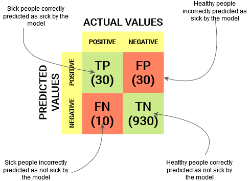

# Predictive data mining
Predictive data mining involves trying to use available data to predict a particular phenomenon on an unseen data set. Clustering and classification techniques are the most common predictive data mining methods.

In this tutorial, we use the following libraries to allow us perform classification and clustering analysis:

* [CRAN tree library](https://cran.r-project.org/web/packages/tree/index.html): package provides functions for classification and regression trees.
* [CRAN ISLR library](https://cran.r-project.org/web/packages/ISLR/index.html): package provides a collection of data sets.

# Installation of libraries
Install and load the following package libraries.


```{r eval=FALSE}
# Installing libraries
install.packages("tree")
install.packages("ISLR") # for the Carseats data set

# Loading Libraries
library(cluster) # for cluster-plot function
library(tree)
library(ISLR)

```


# Usage and documentation

```{r eval=FALSE}
?kmeans

```


# Dealing with data set(s)
We can use the **data()** function to load or check available data sets provided by our installed libraries.


```{r eval=FALSE}
?data  # check examples to understand usage
data()

```


# Clustering

In clustering or cluster analysis in R, we attempt to group objects with similar traits and features together. In this tutorial, we focus on K-means clustering which is the most popular partitioning method. It requires the analyst to specify the number of clusters to extract. However, the biggest headache is determining the appropriate clusters to use.

## Load data set
We use the **mtcars** data set for our clustering analysis. The data set holds records of motor trend car road tests.

```{r eval=FALSE}

data(mtcars)
mydata <- mtcars

# Checkout data set
head(mydata)
summary(mydata)

```


## Cleaning data set


```{r eval=FALSE}
mydata <- na.omit(mydata) # listwise deletion of missing
mydata <- scale(mydata) # standardize variables
mydata <- as.data.frame(mydata) # to remmove indexing error after scaling

# Use 'Environment tab' to checkout data set easily
head(mydata)
ncol(mydata)
nrow(mydata)
colnames(mydata)

```

## Scatter plots
We plot scatter plots to see the distribution of data points before clustering them into groups.

```{r eval=FALSE}
mydata$wt # load only data from column 'wt'
mydata[c("wt", "mpg")] # load only data from columns 'wt' and 'mpg'

# 1. Scatter plots using plot() function
?plot
plot(mydata$wt, mydata$mpg, col="red",ylab="Miles/(US) gallon",xlab="Weight (1000 lbs)")

# 2. Scatter plots using cluspot() function
?clusplot
all <- kmeans(mydata[c("wt", "mpg")], 1) # 1 cluster solution, to draw scatter plot
clusplot(mydata[c("wt", "mpg")], all$cluster, labels=2)

```


## K-Means clustering

We perform K-Means Cluster Analysis as follows. We manually set the number of clusters to 5.


```{r eval=FALSE}
km <- kmeans(mydata[c("wt", "mpg")], 5) # 5 cluster solution, based 'wt' and 'mpg' columns
km$cluster

```

## Plot the clusters

We can plot a graphs that reveals our 5 clusters using the **cluspot()** function as shown below.

```{r eval=FALSE}
# Cluster Plot against 1st 2 principal components
clusplot(mydata[c("wt", "mpg")], km$cluster, color=TRUE, shade=TRUE, labels=2, lines=0)

```

# Classification
Decision tree is a type of supervised learning algorithm that can be used in both regression and classification problems. It works for both categorical and continuous input and output variables.

This tutorial was adopted from: [R Decision Trees Tutorial](https://www.datacamp.com/tutorial/decision-trees-R)

## Load data set
We use the **Carseats** data set for our classification tutorial. The data set records the Sales of Child Car Seats

```{r eval=FALSE}

data(Carseats)
mydata <- Carseats
head(mydata)
summary(data)

```

## Creating a binary variable
Observe that *Income* is a quantitative variable. In order to demonstrate the use of decision trees we convert it into a binary variable. It then becomes our **target/response** variable; we use the remaining variables/features as **predictor** variables.


```{r eval=FALSE}

income_cat <- ifelse(mydata$Income <= 68, "Low", "High")
new_data <- data.frame(mydata, income_cat)
new_data$income_cat <- as.factor(new_data$income_cat) # Take care of an error
head(new_data)
# class(new_data$income_cat)

```

## Splitting train and test data sets
We use the following function to split our original data set into 2 data sets: train data set and test data set.


```{r eval=FALSE}

split_data <- function(data, size = 0.8, train = TRUE) {
  n_row = nrow(data)
  total_row = size * n_row
  train_sample <- 1: total_row
  if (train == TRUE) {
    return (data[train_sample, ])
  } else {
    return (data[-train_sample, ])
  }
}


```

We split the data set into 75% train data set and remaining 25% for test data set.

```{r eval=FALSE}

# Split data set
train_data <- split_data(new_data, 0.75, train = TRUE)
test_data <- split_data(new_data, 0.75, train = FALSE)
dim(train_data)
dim(test_data)

```


## Train the decision tree model
We train our model to predict **income_cat** from the remaining features.


```{r eval=FALSE}

# Train model
?tree
set.seed(101)
model <- tree(income_cat~.-Income, data = train_data)
summary(model)
# income_cat is the target/response feature/variable
# all other features are predictor variables (except Income since income_cat was created from it)
# formula 1: income_cat ~. - Income (NB: . means all remaining features)
# formula 2: income_cat ~ Sales + CompPrice + Advertising + ... + US


```


```{r eval=FALSE}


plot(model)
text(model, pretty=0)

```

## Testing the model on test data set
We test the model to predict values of **income_cat** on the unseen test data set. We construct a confusion matrix to show the performance of the model.

```{r eval=FALSE}
# Test model by prediction on test_data
?predict
pred_unseen = predict(model, test_data, type="class")
with(test_data, table(income_cat, pred_unseen))
# OR 
conf_mat <- table(test_data$income_cat, pred_unseen)
conf_mat


```

## Measuring performance
The confusion matrix is a better choice to evaluate the classification performance. The general idea is to count the number of times True instances are classified are False and populate them in a confusion matrix as illustrated in the figure below.



The confusion matrix can be used to compute the accuracy, precision and recall of the model, as illustrated in the figure below.


```{r eval=FALSE}

accuracy <- sum(diag(conf_mat)) / sum(conf_mat)
# precision <- (17+35) / 100
# recal <- (22+35) / 100

```


# Questions
1. Which techniques can be used to determine the appropriate number of clusters?
2. How can you modify the cluster analysis on data set **mtcars**; so that, the grouping is based on all the features?
3. How can you modify the formula of the **tree()** function; so that, we build a model that classifies the *income_cat* variable using only **Sales, CompPrice, Advertising, Education** features?


# Exercise
This exercise is an assignment and you are required to:

a. Perform cluster analysis involving features "hp", "gear" and "vs" of data set **mtcars**.
b. In your cluster analysis, which car models seem to share the most characteristics?
c. Implement a classification model that uses **Sales** variable as the target variable.
d. What is the accuracy, precision and recall of your classification model?

